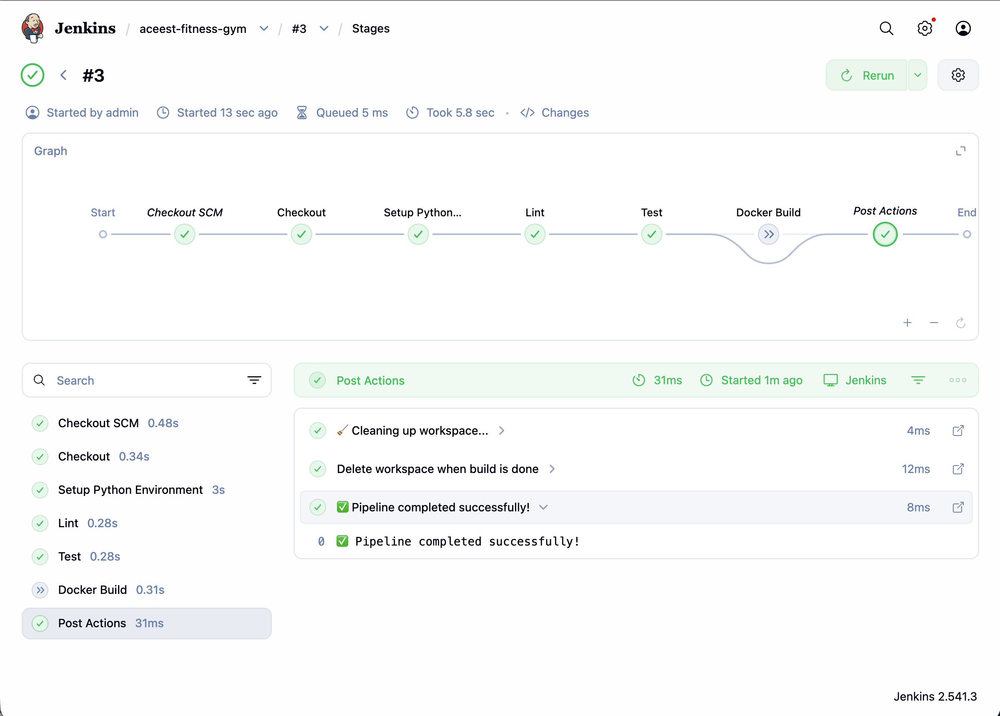

# ACEest Fitness & Gym 💪

> A Flask-based web application for fitness and gym management, fully containerised with Docker, tested with Pytest, and delivered via automated CI/CD pipelines (GitHub Actions + Jenkins).

---

## Table of Contents

1. [Project Overview](#project-overview)
2. [Tech Stack](#tech-stack)
3. [Project Structure](#project-structure)
4. [Prerequisites](#prerequisites)
5. [Complete Setup Guide (Step-by-Step)](#complete-setup-guide-step-by-step)
6. [Running the Application](#running-the-application)
7. [Interactive UI Dashboard](#interactive-ui-dashboard)
8. [Running Tests &amp; Linting](#running-tests--linting)
9. [Docker – Build, Run &amp; Test](#docker--build-run--test)
10. [Git – Version Control Workflow](#git--version-control-workflow)
11. [CI/CD – GitHub Actions](#cicd--github-actions)
12. [CI/CD – Jenkins Integration](#cicd--jenkins-integration)
13. [API Endpoints &amp; Usage Examples](#api-endpoints--usage-examples)
14. [Important Commands Cheat Sheet](#important-commands-cheat-sheet)
15. [Troubleshooting](#troubleshooting)
16. [Version History](#version-history)

---

## Project Overview

ACEest Fitness & Gym is a rapidly scaling startup. This repository contains the **Flask web application** and the complete **DevOps pipeline** infrastructure that ensures:

- ✅ Code quality via linting (flake8)
- ✅ Functional correctness via automated tests (pytest)
- ✅ Environment consistency via containerisation (Docker)
- ✅ Continuous Integration & Delivery via GitHub Actions and Jenkins

---

## Tech Stack

| Layer                      | Technology                        |
| -------------------------- | --------------------------------- |
| **Language**         | Python 3.9+                       |
| **Framework**        | Flask 3.0                         |
| **Testing**          | Pytest 8.2                        |
| **Linting**          | Flake8 7.1                        |
| **Containerisation** | Docker (python:3.9-slim)          |
| **WSGI Server**      | Gunicorn 22.0                     |
| **Package Manager**  | uv (local) / pip (CI/CD & Docker) |
| **CI/CD**            | GitHub Actions, Jenkins           |

---

## Project Structure

```
aceest-project/
├── app.py                     # Flask application (all routes & business logic)
├── test_app.py                # Pytest test suite (42 tests – unit + integration)
├── requirements.txt           # Python dependencies (used by pip, Docker & CI)
├── Dockerfile                 # Container image definition (python:3.9-slim)
├── Jenkinsfile                # Jenkins declarative pipeline
├── .github/
│   └── workflows/
│       └── main.yml           # GitHub Actions CI/CD workflow
├── templates/
│   └── index.html             # Interactive UI dashboard (served at /ui)
├── .gitignore                 # Files excluded from version control
├── README.md                  # This file
└── Aceestver-*.py             # Historical version snapshots (1.0 → 3.2.4)
```

---

## Prerequisites

Before you begin, make sure you have the following installed:

| Tool                     | Purpose                                 | Install                                                                 |
| ------------------------ | --------------------------------------- | ----------------------------------------------------------------------- |
| **Python 3.9+**    | Runtime                                 | [python.org](https://www.python.org/downloads/) or `brew install python` |
| **uv**             | Fast Python package manager (local dev) | `curl -LsSf https://astral.sh/uv/install.sh \| sh`                     |
| **Docker Desktop** | Containerisation                        | [docker.com](https://www.docker.com/products/docker-desktop/)              |
| **Git**            | Version control                         | `brew install git` or [git-scm.com](https://git-scm.com/)                |
| **curl**           | API testing from terminal               | Pre-installed on macOS/Linux                                            |

### Verify installations

```bash
python3 --version       # Should show 3.9+
uv --version            # Should show uv version
docker --version        # Should show Docker version
git --version           # Should show git version
```

---

## Complete Setup Guide (Step-by-Step)

### 1. Clone the Repository

```bash
git clone git@github.com:ShreehariA/aceest-fitness-gym.git
cd aceest-fitness-gym
```

### 2. Create Virtual Environment with `uv`

We use **uv** instead of pip locally because it's significantly faster.

```bash
# Create the virtual environment
uv venv

# Activate it
source .venv/bin/activate        # macOS / Linux
# .venv\Scripts\activate         # Windows
```

### 3. Install Dependencies

```bash
uv pip install -r requirements.txt
```

This installs: `flask`, `pytest`, `flake8`, `gunicorn`

### 4. Verify Setup

```bash
# Check all packages are installed
uv pip list
```

You should see flask, pytest, flake8, gunicorn and their dependencies.

---

## Running the Application

### Option 1: Using `uv run` (recommended for local dev)

```bash
cd aceest-fitness-gym
uv run flask run --port 5001
```

### Option 2: Activate venv first, then run

```bash
source .venv/bin/activate
flask run --port 5001
```

### Option 3: Run directly with Python

```bash
source .venv/bin/activate
python app.py
# Runs on http://localhost:5000 (default)
```

> **⚠️ macOS Note:** Port 5000 is often used by AirPlay Receiver. Use `--port 5001` to avoid conflicts, or disable AirPlay in System Settings → General → AirDrop & Handoff.

### Verify the App is Running

Open a **new terminal tab** and run:

```bash
curl http://127.0.0.1:5001/
```

Expected response:

```json
{
  "endpoints": ["/members", "/classes", "/workouts", "/bmi", "/calories", "/about"],
  "message": "Welcome to ACEest Fitness & Gym 💪",
  "version": "3.2.4"
}
```

### Stop the App

Press `Ctrl + C` in the terminal where the app is running.

---

## Interactive UI Dashboard

The project includes a **built-in interactive web dashboard** that lets you explore and test every API endpoint directly from your browser — no curl or Postman needed.

### Access the Dashboard

With the Flask app running, open:

```
http://127.0.0.1:5001/ui
```

### Dashboard Features

| Section              | What You Can Do                                                        |
| -------------------- | ---------------------------------------------------------------------- |
| **🏠 Home**          | View live stats — member count, classes, workouts, app version         |
| **👥 Members**       | Register, edit (update program), and delete members via forms          |
| **📋 Classes**       | Browse all fitness classes with trainer and schedule info               |
| **🏃 Workouts**      | Log new workouts for members with type, duration, and notes            |
| **⚖️ BMI Calculator** | Enter weight & height, get colour-coded BMI result and category        |
| **🔥 Calorie Estimator** | Full calorie calculator with gender and activity level             |
| **📡 Raw API Tester** | Send any HTTP method to any endpoint — like a built-in mini-Postman   |

> The Raw API Tester tab includes **quick-access buttons** for all common endpoints, making it easy to experiment with the API and see raw JSON responses.

### Technical Details

- The dashboard is a **single HTML file** with inline CSS and JavaScript — no build step or extra dependencies required.
- Served by Flask's `render_template` via the `/ui` route.
- Communicates with all existing API endpoints using `fetch()` from the browser.
- Fully responsive dark-themed design.

---

## Running Tests & Linting

### Run the Full Test Suite (42 tests)

```bash
cd aceest-fitness-gym

# Using uv run (no need to activate venv)
uv run pytest test_app.py -v

# OR activate venv first
source .venv/bin/activate
pytest test_app.py -v --tb=short
```

Expected: **42 passed** ✅

### Run Linter (flake8)

```bash
# Critical errors only (must pass)
uv run flake8 app.py test_app.py --count --select=E9,F63,F7,F82 --show-source --statistics

# Full style check (warnings are OK)
uv run flake8 app.py test_app.py --count --exit-zero --max-complexity=10 --max-line-length=120 --statistics
```

### Run Tests with Coverage (optional)

```bash
uv pip install pytest-cov
uv run pytest test_app.py -v --cov=app --cov-report=term-missing
```

---

## Docker – Build, Run & Test

### Build the Docker Image

```bash
cd aceest-fitness-gym
docker build -t aceest-fitness-gym:latest .
```

### Run the Container

```bash
docker run -d -p 5002:5000 --name aceest aceest-fitness-gym:latest
```

> Maps container port 5000 → host port 5002. Change `5002` to any free port.

### Verify the Container is Running

```bash
# Check container status
docker ps

# Test the API
curl http://127.0.0.1:5002/

# Test the UI dashboard
curl -s -o /dev/null -w "%{http_code}" http://127.0.0.1:5002/ui
# Should return 200

# Check container logs
docker logs aceest
```

> **UI Dashboard in Docker:** Open http://127.0.0.1:5002/ui in your browser to access the interactive dashboard from the container.

### Run Tests Inside the Container

```bash
docker exec aceest pytest test_app.py -v
```

### Stop & Remove the Container

```bash
docker stop aceest && docker rm aceest
```

### Useful Docker Commands

```bash
docker images                    # List all images
docker ps                        # List running containers
docker ps -a                     # List all containers (including stopped)
docker logs <container-name>     # View container logs
docker exec -it aceest /bin/bash # Open a shell inside the container
docker rmi aceest-fitness-gym    # Remove the image
```

---

## Git – Version Control Workflow

### First-Time Setup (already done)

```bash
cd aceest-project
git init
git checkout -b main
git add .
git commit -m "feat: initial commit"
git remote add origin git@github.com:ShreehariA/aceest-fitness-gym.git
git push -u origin main
```

### Day-to-Day Workflow

```bash
# 1. Check what's changed
git status

# 2. Stage your changes
git add app.py test_app.py          # specific files
# OR
git add .                            # everything

# 3. Commit with a descriptive message
git commit -m "fix: resolve BMI calculation edge case"

# 4. Push to GitHub (triggers CI/CD automatically)
git push
```

### Useful Git Commands

```bash
git log --oneline                # View commit history
git diff                         # See unstaged changes
git diff --staged                # See staged changes
git branch                       # List branches
git checkout -b feature-name     # Create & switch to new branch
git stash                        # Temporarily save uncommitted changes
git stash pop                    # Restore stashed changes
```

### Commit Message Convention

```
feat: add new endpoint for workout tracking
fix: correct BMI calculation for edge cases
test: add unit tests for calorie estimator
docs: update README with Docker instructions
chore: update dependencies in requirements.txt
```

---

## CI/CD – GitHub Actions

The workflow file is at `.github/workflows/main.yml`.

> 🔗 **Live pipeline status:** Go to the [**Actions tab**](https://github.com/ShreehariA/aceest-fitness-gym/actions) on the GitHub repo to view all pipeline runs and their results.

### Trigger

Every **push** or **pull_request** to the `main` branch automatically triggers the pipeline.

### Pipeline Stages

```
┌──────────────┐     ┌──────────────┐     ┌──────────────┐
│  🔍 Lint     │────▶│  🧪 Test     │────▶│  🐳 Docker   │
│  (flake8)    │     │  (pytest)    │     │  (build &    │
│              │     │              │     │   verify)    │
└──────────────┘     └──────────────┘     └──────────────┘
```

1. **Lint** – Runs `flake8` to catch syntax errors and code-quality issues.
2. **Test** – Executes the full `pytest` suite; the pipeline fails if any test fails.
3. **Docker** – Builds the Docker image and performs a smoke test (starts the container and verifies a `200 OK` response from `/`).

### Re-run a Failed Pipeline

- Push a fix: `git push` (triggers automatically)
- Or click **Re-run all jobs** on the Actions page

---

## CI/CD – Jenkins Integration

### Overview

A `Jenkinsfile` (declarative pipeline) is included for Jenkins-based builds. Unlike GitHub Actions, **Jenkins is self-hosted** — you run it on your own machine via Docker.

### Jenkins Build Result

The screenshot below shows a successful Jenkins pipeline run (Build #3) for this project:



All stages completed successfully:

| Stage                              | Time  | Status                                                       |
| ---------------------------------- | ----- | ------------------------------------------------------------ |
| **Checkout SCM**             | 0.48s | ✅ Passed                                                    |
| **Checkout**                 | 0.34s | ✅ Passed                                                    |
| **Setup Python Environment** | 3s    | ✅ Passed                                                    |
| **Lint**                     | 0.28s | ✅ Passed                                                    |
| **Test**                     | 0.28s | ✅ Passed                                                    |
| **Docker Build**             | 0.31s | ⏭️ Skipped (Docker not available inside Jenkins container) |
| **Post Actions**             | 31ms  | ✅ Workspace cleaned                                         |

> **Note:** The Docker Build stage is conditionally skipped when Docker is not installed inside the Jenkins container. Docker image building is handled by **GitHub Actions** and verified locally.

### Pipeline Stages

| Stage                              | Description                                                 |
| ---------------------------------- | ----------------------------------------------------------- |
| **Checkout**                 | Pulls the latest code from the connected GitHub repo        |
| **Setup Python Environment** | Creates a Python venv and installs all dependencies via pip |
| **Lint**                     | Runs `flake8` static analysis for syntax errors           |
| **Test**                     | Runs the full `pytest` suite (42 tests)                   |
| **Docker Build**             | Builds the Docker image (skipped if Docker is unavailable)  |

### What We Did – Step by Step

#### 1. Started Jenkins via Docker

```bash
docker run -d -p 8080:8080 -p 50000:50000 \
  -v jenkins_home:/var/jenkins_home \
  --name jenkins jenkins/jenkins:lts
```

#### 2. Retrieved the initial admin password

```bash
docker exec jenkins cat /var/jenkins_home/secrets/initialAdminPassword
```

#### 3. Configured Jenkins (in browser at http://localhost:8080)

1. Pasted the admin password
2. Clicked **Install suggested plugins** (waited for installation)
3. Created an admin user
4. Accepted the default Jenkins URL

#### 4. Installed Python inside the Jenkins container

The Jenkins Docker image doesn't come with Python pre-installed, so we installed it:

```bash
docker exec -u root jenkins bash -c \
  "apt-get update && apt-get install -y python3 python3-pip python3-venv"
```

#### 5. Created the Pipeline Job

1. Dashboard → **New Item** → named it `aceest-fitness-gym` → selected **Pipeline** → OK
2. Under **Pipeline → Definition**, selected **Pipeline script from SCM**
3. Set **SCM** to **Git**
4. Entered repo URL: `https://github.com/ShreehariA/aceest-fitness-gym.git`
5. Set **Branch** to `*/main`
6. Clicked **Save** → **Build Now**

#### 6. Build Result

The pipeline ran successfully — Checkout, Setup, Lint, and Test all passed. The Docker Build stage was gracefully skipped (Docker CLI isn't available inside the Jenkins container). Total build time: **~5.8 seconds**.

### Stop & Clean Up Jenkins

```bash
docker stop jenkins && docker rm jenkins
# To also remove the persistent volume:
docker volume rm jenkins_home
```

---

## API Endpoints & Usage Examples

### All Endpoints

| Method     | Endpoint          | Description                        |
| ---------- | ----------------- | ---------------------------------- |
| `GET`    | `/`             | Welcome page & available endpoints |
| `GET`    | `/ui`           | Interactive UI dashboard           |
| `GET`    | `/about`        | Application information            |
| `GET`    | `/members`      | List all members                   |
| `POST`   | `/members`      | Register a new member              |
| `GET`    | `/members/<id>` | Get member by ID                   |
| `PUT`    | `/members/<id>` | Update a member                    |
| `DELETE` | `/members/<id>` | Remove a member                    |
| `GET`    | `/classes`      | List fitness classes               |
| `GET`    | `/classes/<id>` | Get class by ID                    |
| `GET`    | `/workouts`     | List all workouts                  |
| `POST`   | `/workouts`     | Log a new workout                  |
| `POST`   | `/bmi`          | Calculate BMI                      |
| `POST`   | `/calories`     | Estimate daily caloric needs       |

### Example Requests

```bash
# Home page
curl http://127.0.0.1:5001/

# Register a member
curl -X POST http://127.0.0.1:5001/members \
  -H "Content-Type: application/json" \
  -d '{"name": "Alice", "age": 28, "weight": 65, "height": 1.68, "program": "Fat Loss"}'

# List all members
curl http://127.0.0.1:5001/members

# Get member by ID
curl http://127.0.0.1:5001/members/1

# Update a member
curl -X PUT http://127.0.0.1:5001/members/1 \
  -H "Content-Type: application/json" \
  -d '{"program": "Muscle Gain"}'

# Delete a member
curl -X DELETE http://127.0.0.1:5001/members/1

# List fitness classes
curl http://127.0.0.1:5001/classes

# Log a workout
curl -X POST http://127.0.0.1:5001/workouts \
  -H "Content-Type: application/json" \
  -d '{"member_id": 1, "type": "Strength", "duration_min": 45, "notes": "Leg day"}'

# Calculate BMI
curl -X POST http://127.0.0.1:5001/bmi \
  -H "Content-Type: application/json" \
  -d '{"weight_kg": 70, "height_m": 1.75}'

# Estimate daily calories
curl -X POST http://127.0.0.1:5001/calories \
  -H "Content-Type: application/json" \
  -d '{"weight_kg": 75, "height_cm": 175, "age": 30, "gender": "male", "activity": "moderate"}'
```

---

## Important Commands Cheat Sheet

### Quick Reference

```bash
# ──────────── SETUP ────────────
uv venv                                    # Create virtual environment
source .venv/bin/activate                  # Activate venv
uv pip install -r requirements.txt         # Install dependencies

# ──────────── RUN APP ────────────
uv run flask run --port 5001               # Start Flask app (recommended)
# OR
source .venv/bin/activate && python app.py # Alternative (runs on port 5000)

# ──────────── TEST & LINT ────────────
uv run pytest test_app.py -v               # Run all 42 tests
uv run flake8 app.py test_app.py           # Run linter

# ──────────── DOCKER ────────────
docker build -t aceest-fitness-gym .       # Build image
docker run -d -p 5002:5000 --name aceest aceest-fitness-gym:latest  # Run
curl http://127.0.0.1:5002/ui              # Verify UI dashboard
docker exec aceest pytest test_app.py -v   # Test inside container
docker logs aceest                         # View logs
docker stop aceest && docker rm aceest     # Cleanup

# ──────────── GIT ────────────
git add .                                  # Stage all changes
git commit -m "feat: description"          # Commit
git push                                   # Push (triggers CI/CD)
git status                                 # Check repo status
git log --oneline                          # View history

# ──────────── JENKINS ────────────
docker run -d -p 8080:8080 -p 50000:50000 -v jenkins_home:/var/jenkins_home --name jenkins jenkins/jenkins:lts
docker exec jenkins cat /var/jenkins_home/secrets/initialAdminPassword
```

---

## Troubleshooting

### Port 5000 already in use (macOS)

macOS uses port 5000 for AirPlay Receiver. Solutions:

```bash
# Option 1: Use a different port
uv run flask run --port 5001

# Option 2: Kill the process on port 5000
lsof -ti:5000 | xargs kill -9

# Option 3: Disable AirPlay Receiver
# System Settings → General → AirDrop & Handoff → AirPlay Receiver → OFF
```

### `python: command not found`

Use `python3` instead of `python`, or use `uv run` which handles it automatically:

```bash
uv run python app.py        # Works without activating venv
uv run flask run --port 5001 # Works without activating venv
```

### Docker container crashes with `dict | None` error

The `dict | None` type hint syntax requires Python 3.10+. The app uses `from __future__ import annotations` to stay compatible with Python 3.9 (used in Docker). If you see this error, ensure the import is at the top of `app.py`.

### `ModuleNotFoundError: No module named 'app'`

Make sure you're inside the `aceest-fitness-gym/` directory:

```bash
cd aceest-fitness-gym
uv run flask run --port 5001
```

### Tests fail with `404` on member operations

Ensure the `reset_data` fixture in `test_app.py` resets the ID counters:

```python
app_module._next_member_id = 1
app_module._next_workout_id = 1
```

### GitHub Actions pipeline fails

1. Go to https://github.com/ShreehariA/aceest-fitness-gym/actions
2. Click the failed run → expand the failed step
3. Read the error logs and fix locally
4. Push the fix: `git add . && git commit -m "fix: ..." && git push`

---

## Version History

| Version | Highlights                           |
| ------- | ------------------------------------ |
| 1.0     | Initial fitness tracker script       |
| 1.1     | Added BMI and calorie calculations   |
| 1.1.2   | Bug fixes, improved input validation |
| 2.0.1   | Introduced SQLite database layer     |
| 2.1.2   | Added workout logging module         |
| 2.2.1   | Membership billing & status tracking |
| 2.2.4   | PDF report generation                |
| 3.0.1   | Migrated to Flask web application    |
| 3.1.2   | Full REST API with CRUD for members  |
| 3.2.4   | Docker + CI/CD pipeline (current)    |

---

## Author

**ACEest DevOps Team** – Introduction to DevOps (CSIZG514 / SEZG514 / SEUSZG514) – S2-25

---

## License

This project is for academic purposes as part of the DevOps coursework.
